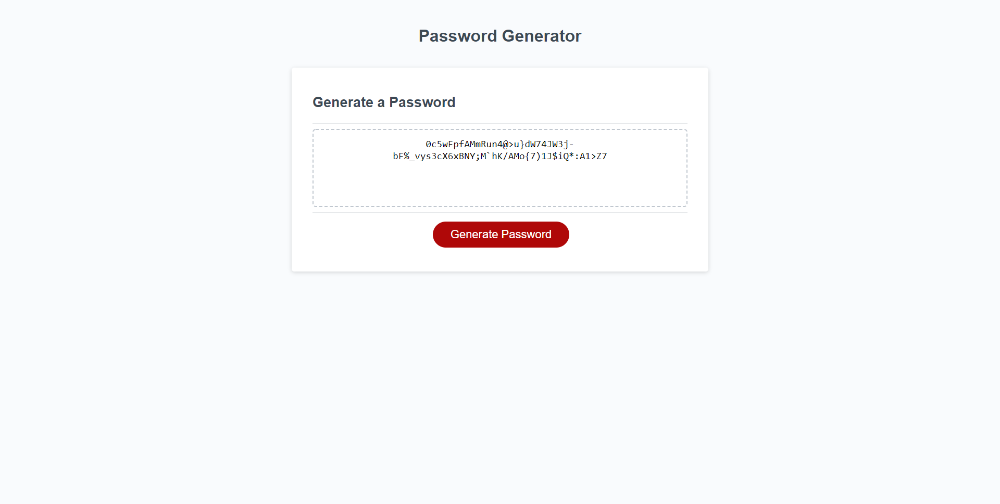

# 03 JavaScript: Password Generator

## Table of Contents
1. [Description](#description)
2. [Visuals](#visuals)
3. [Resources](#resources)

## Description
Took an assignment code for a password generating site and made it follow the criteria. The user is able to select which characters and password length they want, and have a random password generated for them. If the incorrect information, or not enough information is selected the site will produce an error messgage.

## Visuals

## Resources
- [Live Site](https://selaprivette.github.io/passwordgenerator/) 
- [Repository](https://github.com/selaprivette/portfolio)

